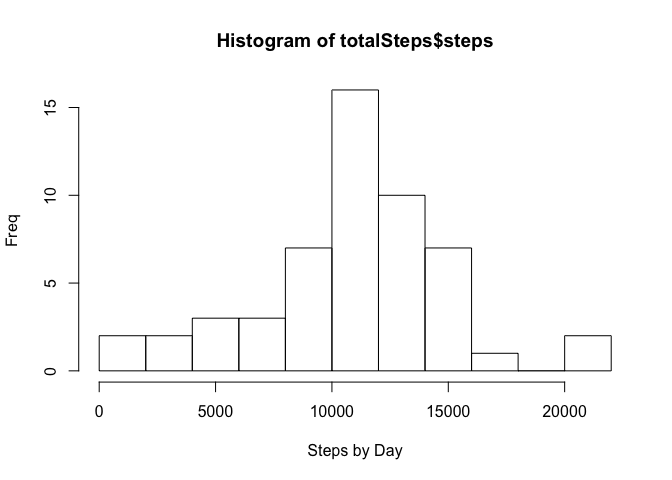
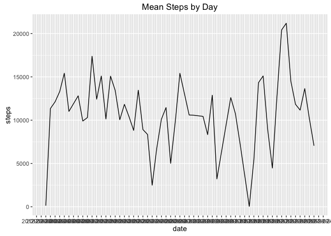
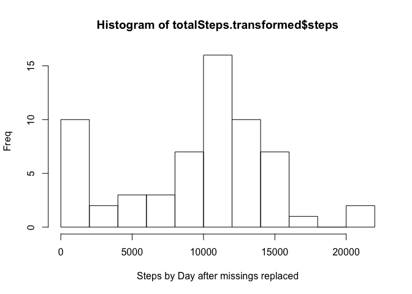

## Loading and preprocessing the data
__First, load in the packages ggplot2 and plyr__

```r
library(ggplot2)
library(plyr)
```

__Then, read in activity.csv and save it to R object data.all. with the following two additional steps.__

* Set the steps column as numeric, date column as date, and interval column as numeric.  
* Maintain the first row of the csv as column headers.


```r
data.all <- read.csv(file = 'activity.csv', header = TRUE, colClasses = c('numeric', 'Date', 'numeric'))
```

__Now that data.all exist, aggregate the number of steps, grouped by day.__

* Keep missings in the set.  They'll be dealt with later.


```r
totalSteps<-aggregate(steps~date,data=data.all,sum,na.rm=FALSE)
```

## What is mean total number of steps taken per day?
__Here is the code__

```r
meanSteps.byday<-aggregate(steps~date,data=totalSteps,mean,na.rm=FALSE)
meanSteps.total <- mean(totalSteps$steps, na.rm = FALSE)

medianSteps.byday<-aggregate(steps~date,data=totalSteps,median,na.rm=FALSE)
medianSteps.total <- median(totalSteps$steps, na.rm = FALSE)
```

__And here are the results__

* The Mean Number of Steps per day (keeping missing values) is 10766.19 
* The Median Number of Steps per day (keeping missing values) is 10765 

## What is the average daily activity pattern?
__Take a look at a histogram of steps by day.__


```r
hist(totalSteps$steps, breaks = 10, xlab = 'Steps by Day', ylab = 'Freq')
```



__Now a time series plot of steps by day.__


```r
ggplot(data = meanSteps.byday, aes(date, steps)) + 
  geom_line() +
  scale_x_date(date_breaks = "1 day") + 
  ggtitle("Mean Steps by Day")
```



## Imputing missing values
__To deal with missing data in the steps column, I'll do two treatments in series.__

* First, calculate the mean number of steps by day for each day.
* If a date has missing values, but at least one non-missing value, replace each with the daily mean.
* If a date has _all_ missing values, overwrite them with 0.


```r
replace.with.mean <- function(x, fun) { 
  missing <- is.na(x) 
  replace(x, missing, fun(x[!missing])) 
} 


data.transformed <- ddply(data.all, ~ date, transform, steps = replace.with.mean(steps, mean))

data.transformed[is.na(data.transformed)] <- 0
```

__Now that we've removed missing values, let's take another look at average steps per day.__

```r
totalSteps.transformed <- aggregate(steps~date,data=data.transformed,sum, na.rm=FALSE)
meanSteps.byday.replaced<-aggregate(steps~date,data=totalSteps.transformed,mean,na.rm=FALSE)
meanSteps.total.replaced <- mean(totalSteps.transformed$steps, na.rm = FALSE)

medianSteps.byday.replaced<-aggregate(steps~date,data=totalSteps.transformed,median,na.rm=FALSE)
medianSteps.total.replaced <- median(totalSteps.transformed$steps, na.rm = FALSE)

abs.mean.diff <- abs(meanSteps.total - meanSteps.total.replaced)
abs.median.diff <- abs(medianSteps.total - medianSteps.total.replaced)
mean.pct.diff <- paste(round((abs.mean.diff / meanSteps.total)*100,digits = 2),'%')
median.pct.diff <- paste(round((abs.median.diff / medianSteps.total)*100,digits = 2),'%')
```

__And here are the results__

* The Mean Number of Steps per day (replacing missing values): 9354.23 
* The Median Number of Steps per day (replacing missing values): 10395 
    
__How much difference did replacing the MCTs make?__

* The absolute difference in means is 1411.959 with percent change 13.11 %
* The absolute difference in medians is 370 with percent change 3.44 %

__Take a look at a histogram of steps by day after missings are replaced.__


```r
hist(totalSteps.transformed$steps, breaks = 10, xlab = 'Steps by Day after missings replaced', ylab = 'Freq')
```



## Are there differences in activity patterns between weekdays and weekends?

__I'll be building a panel plot of side by side line charts.  First, I need to create data separating weekdays and weekend, then roll up to mean by interval.__

```r
data.transformed.weekday <- subset(data.transformed,  weekdays(date) == 'Saturday' | weekdays(date) == 'Sunday')
data.transformed.weekend <- subset(data.transformed, weekdays(date) != 'Saturday' & weekdays(date) != 'Sunday')

meanSteps.byweekend.transform<-aggregate(steps~interval,data=data.transformed.weekend,mean)
meanSteps.byweekday.transform<-aggregate(steps~interval,data=data.transformed.weekday,mean)
```

__Now, create the line charts for weekend days and week days.__


```r
weekend <- ggplot(data = meanSteps.byweekend.transform, aes(interval, steps)) + 
  geom_line() +
  ggtitle("Mean Steps by Interval for Weekend")

weekday <- ggplot(data = meanSteps.byweekday.transform, aes(interval, steps)) + 
  geom_line() +
  ggtitle("Mean Steps by Interval for Week Days")
```

__I took this function from an R cookbook that creates a plot planel of pre-existing R plots.__


```r
multiplot <- function(..., plotlist=NULL, file, cols=1, layout=NULL) {
  require(grid)
  
  # Make a list from the ... arguments and plotlist
  plots <- c(list(...), plotlist)
  
  numPlots = length(plots)
  
  # If layout is NULL, then use 'cols' to determine layout
  if (is.null(layout)) {
    # Make the panel
    # ncol: Number of columns of plots
    # nrow: Number of rows needed, calculated from # of cols
    layout <- matrix(seq(1, cols * ceiling(numPlots/cols)),
                     ncol = cols, nrow = ceiling(numPlots/cols))
  }
  
  if (numPlots==1) {
    print(plots[[1]])
    
  } else {
    # Set up the page
    grid.newpage()
    pushViewport(viewport(layout = grid.layout(nrow(layout), ncol(layout))))
    
    # Make each plot, in the correct location
    for (i in 1:numPlots) {
      # Get the i,j matrix positions of the regions that contain this subplot
      matchidx <- as.data.frame(which(layout == i, arr.ind = TRUE))
      
      print(plots[[i]], vp = viewport(layout.pos.row = matchidx$row,
                                      layout.pos.col = matchidx$col))
    }
  }
}
```
__Now to produce the plot panel.__


```r
multiplot(weekday, weekend, cols=2)
```


